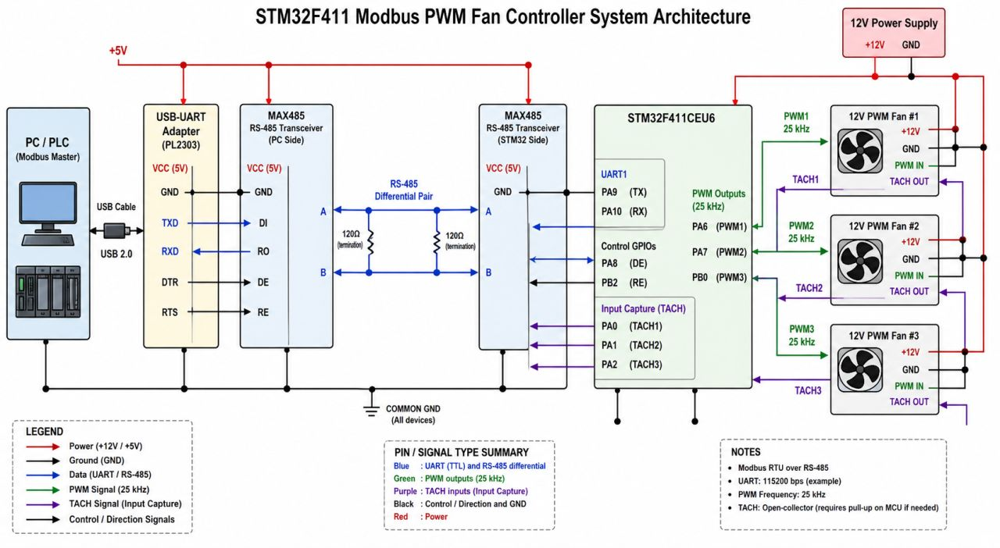
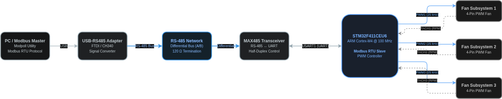
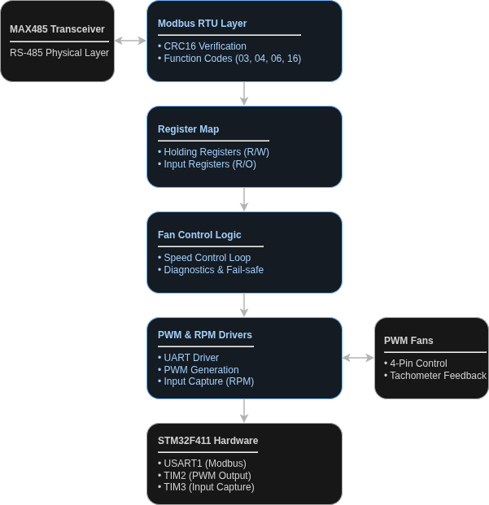

<div align="center">

# STM32F411CEU6 Modbus PWM Controller

Bare-metal Modbus RTU slave for PWM fan control over RS-485

[](https://www.st.com/en/microcontrollers-microprocessors/stm32f411.html)
[](Makefile)
[
](https://en.cppreference.com/w/c)
[](https://modbus.org/)

[Overview](#overview) •
[Hardware](#hardware) •
[Software Architecture](#software-architecture) •
[Register Map](#register-map) •
[Build](#build) •
[Testing](#testing)

</div>

---

## Overview

STM32F411-based Modbus RTU slave controller designed for controlling up to three PWM fans over an RS-485 network.

### Features

* Bare-metal STM32 development (CMSIS, no HAL)
* Modbus RTU slave implementation
* RS-485 communication using MAX485
* Three independent PWM outputs
* Tachometer feedback measurement
* Register-based control interface
* Makefile build system
* OpenOCD and GDB debugging support

---

## Hardware

### System Diagram



### Main Components

| Component     | Description               |
| ------------- | ------------------------- |
| STM32F411CEU6 | Main controller           |
| MAX485        | RS-485 transceiver        |
| 12V PWM Fans  | Controlled load           |
| ST-Link V2    | Programming and debugging |
| CP2102        | Modbus testing interface  |

### Connections

| STM32 Pin | Function         |
| --------- | ---------------- |
| PA9       | USART1_TX        |
| PA10      | USART1_RX        |
| PA0       | PWM Fan 1        |
| PA1       | PWM Fan 2        |
| PA2       | PWM Fan 3        |
| PA6       | Fan 1 Tachometer |
| PA7       | Fan 2 Tachometer |



---

## Software Architecture



### Project Structure

```text
src/
├── main.c
├── modbus/
│   ├── modbus_handler.c
│   └── modbus_registers.c
└── hardware/
    ├── uart_ll.c
    ├── timer_pwm.c
    ├── timer_ic.c
    └── gpio_ll.c
```

---

## Register Map

### Holding Registers

| Address | Description      |
| ------- | ---------------- |
| 40001   | Fan 1 Duty Cycle |
| 40002   | Fan 2 Duty Cycle |
| 40003   | Fan 3 Duty Cycle |
| 40004   | PWM Frequency    |
| 40010   | Slave Address    |
| 40011   | Baud Rate        |

### Input Registers

| Address | Description       |
| ------- | ----------------- |
| 30001   | Fan 1 RPM         |
| 30002   | Fan 2 RPM         |
| 30010   | Device Status     |
| 30011   | Uptime            |
| 30012   | Request Counter   |
| 30013   | CRC Error Counter |
| 30014   | Firmware Version  |

---

## Build

```bash
git clone https://github.com/0xTunay/stm32F411cue6-modbus-pwm-controller

cd stm32F411cue6-modbus-pwm-controller

make
```


---

## Testing

Read holding registers:

```bash
modpoll -m rtu -b 9600 -a 1 -r 1 -c 3 -t 4 /dev/ttyUSB0
```

Write fan speed:

```bash
modpoll -m rtu -b 9600 -a 1 -r 1 -t 4 /dev/ttyUSB0 75
```

Read RPM values:

```bash
modpoll -m rtu -b 9600 -a 1 -r 1 -c 2 -t 3 /dev/ttyUSB0
```

---

## Debugging

```bash
openocd -f openocd.cfg
```

```bash
arm-none-eabi-gdb stm32f411-bare-metal.elf
```

--- 
